<div align="center">

# 🎯 AI Vision Detect Pro

### Real-Time Object Detection using YOLOv8, OpenCV &amp; Streamlit

[](https://www.python.org/)
[](https://streamlit.io/)
[](https://github.com/ultralytics/ultralytics)
[](https://pytorch.org/)
[](LICENSE)
[]()

*A production-style computer vision dashboard built for the CodeAlpha Artificial Intelligence Internship.*

</div>

---

## 📖 Project Overview

**AI Vision Detect Pro** is a full-stack, real-time object detection web application. It wraps a YOLOv8 inference engine in a modern, glassmorphism-styled Streamlit dashboard, supporting detection on **images**, **uploaded videos**, and a **live browser webcam feed** — with adjustable confidence/IoU thresholds, five selectable YOLOv8 model sizes, detection analytics, and exportable reports.

It was built to demonstrate practical, end-to-end AI/ML engineering skill: model integration, real-time video pipelines, clean modular architecture, and a polished user-facing product — not just a notebook.

---

## ✨ Features

### Core Detection
- 🖼️ **Image detection** — single or multi-image upload with drag & drop
- 🎬 **Video detection** — frame-by-frame processing with adjustable frame-skip for speed
- 📷 **Live webcam detection** — real-time, browser-based via WebRTC
- 🎯 Adjustable **confidence threshold** and **IoU threshold** sliders
- 5 selectable model sizes: **Nano · Small · Medium · Large · XLarge**

### Analytics &amp; Export
- 📊 Confidence histograms, class-frequency bar &amp; pie charts, detections-over-time trend
- 📈 Per-run and session-wide statistics (object counts, unique classes, avg. confidence, FPS)
- 🕘 Session detection history with filtering
- ⬇️ Export detections to **CSV**, **JSON**, or a generated **Markdown report**
- ⬇️ Download annotated images and processed videos

### UI/UX
- 🎨 Glassmorphism cards over a gradient background
- 🌗 Dark and light theme toggle
- 📱 Responsive layout with animated hover states
- 🧭 Sidebar navigation with live session stats

---

## 🏗️ Architecture

```
┌─────────────────────────────────────────────────────────────────┐
│                            app.py                                │
│        (page config · theming · session state · routing)        │
└───────────────────────────────┬───────────────────────────────────┘
                                 │
        ┌────────────────────────┼─────────────────────────┐
        ▼                        ▼                          ▼
┌───────────────┐      ┌──────────────────┐        ┌─────────────────┐
│  components/  │      │      utils/       │        │     models/      │
│  UI pages      │◄────►│  business logic   │◄──────►│  YOLOv8 weights  │
├───────────────┤      ├──────────────────┤        └─────────────────┘
│ sidebar.py     │      │ detector.py       │
│ dashboard.py   │      │ visualization.py  │
│ uploader.py    │      │ export.py         │
│ webcam.py      │      │ history.py        │
│ analytics.py   │      │ helpers.py        │
└───────────────┘      └──────────────────┘
```

**Data flow:** an uploaded image/video (or a live webcam frame) is validated in `utils/helpers.py`, passed to the cached YOLOv8 model in `utils/detector.py`, converted to a DataFrame by `utils/visualization.py`, rendered as charts/metrics by the relevant `components/` page, logged by `utils/history.py`, and made downloadable by `utils/export.py`.

---

## 🛠️ Tech Stack

| Category | Technology |
|---|---|
| Language | Python 3.14 |
| Web Framework | Streamlit |
| Object Detection | YOLOv8 (Ultralytics) |
| Deep Learning | PyTorch (CPU) |
| Computer Vision | OpenCV |
| Real-time Video | streamlit-webrtc |
| Data Handling | NumPy, Pandas |
| Visualization | Plotly |
| Image Handling | Pillow |
| Config | python-dotenv |

---

## 📦 Requirements

- Python **3.14** (stable)
- pip
- A webcam (optional, only needed for the Live Webcam page)
- ~2 GB free disk space (for model weights + dependencies)

All exact package versions are pinned in [`requirements.txt`](requirements.txt).

---

## 🚀 Installation

```bash
# 1. Clone the repository
git clone https://github.com/<your-username>/AI_Object_Detection.git
cd AI_Object_Detection

# 2. Create a virtual environment
python3.14 -m venv venv
source venv/bin/activate        # Windows: venv\Scripts\activate

# 3. Install dependencies (CPU-only PyTorch build)
pip install -r requirements.txt

# 4. Run the app
streamlit run app.py
```

The app will open automatically at `http://localhost:8501`. YOLOv8 weights are downloaded automatically into `models/` the first time each model size is used.

> **Note:** `requirements.txt` installs the **CPU-only** PyTorch build by default to keep the install lightweight. If you have an NVIDIA GPU and want CUDA acceleration, see the note at the top of `requirements.txt`.

---

## 💻 Usage

| Page | What it does |
|---|---|
| **Home** | Session overview, quick stats, and navigation cards |
| **Image Detection** | Upload image(s) → detect → view/download annotated results |
| **Video Detection** | Upload a video → frame-by-frame detection → download annotated video |
| **Live Webcam** | Real-time detection from your browser's camera |
| **Analytics** | Aggregate charts and exports across the whole session |
| **History** | Browse and filter every detection run this session |

Adjust the **model size**, **confidence threshold**, and **IoU threshold** at any time from the sidebar — changes apply to the next detection run.

---
## 📸 Screenshots

### 🏠 Home


### 🖼️ Image Detection
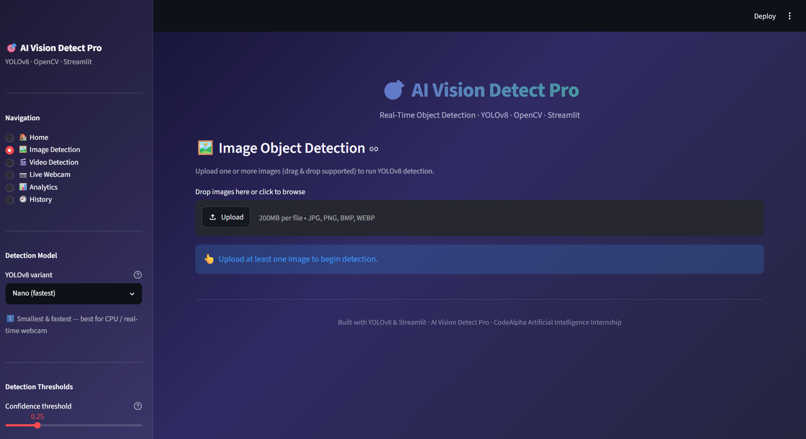
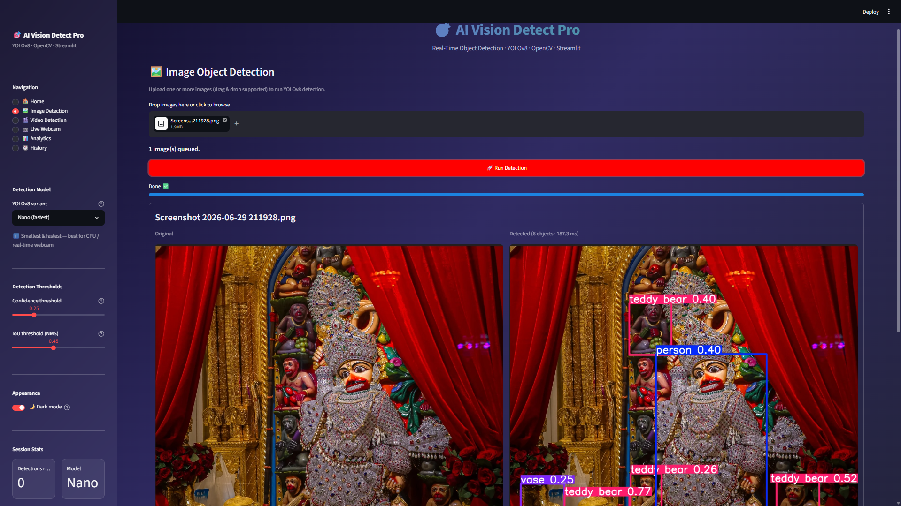
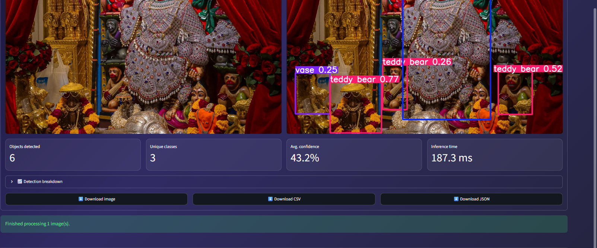

### 🎬 Video Detection
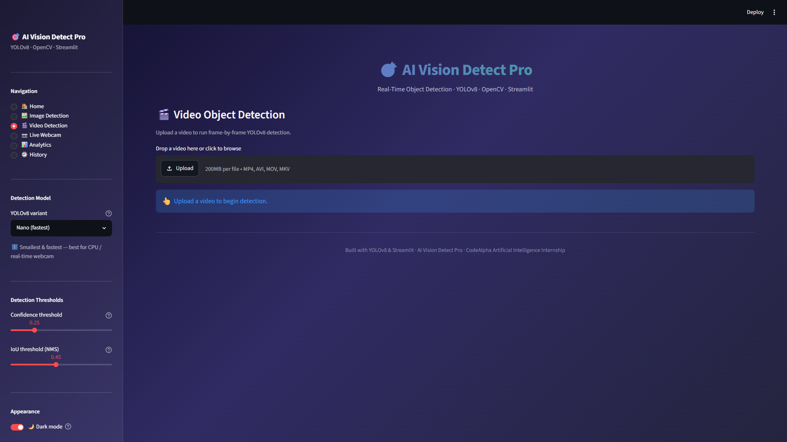
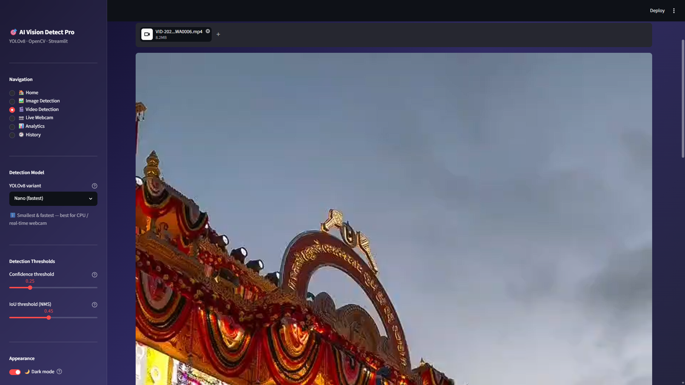
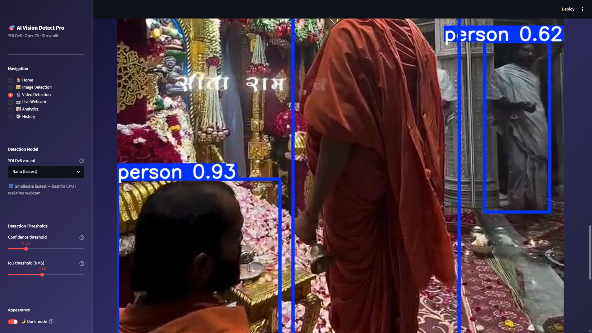
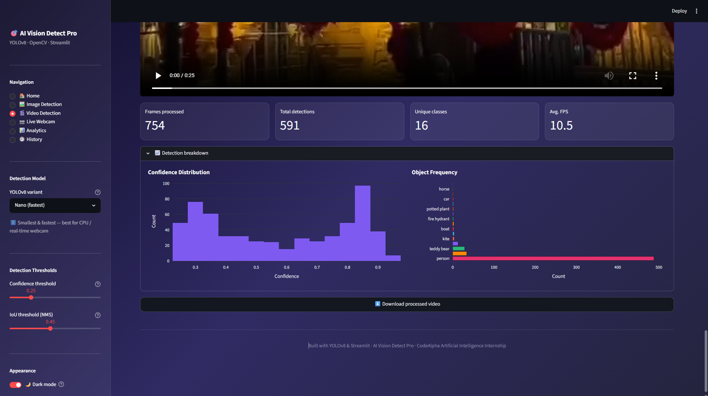

### 📷 Live Webcam
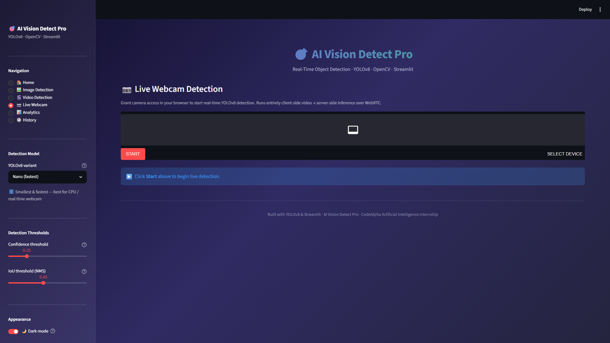
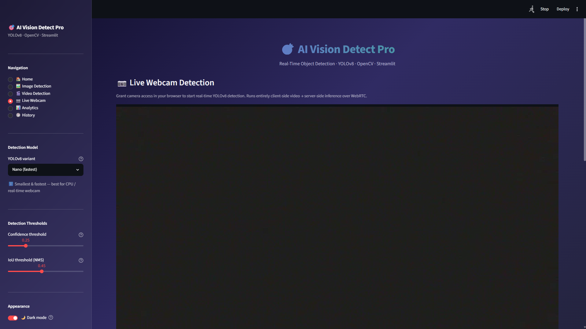
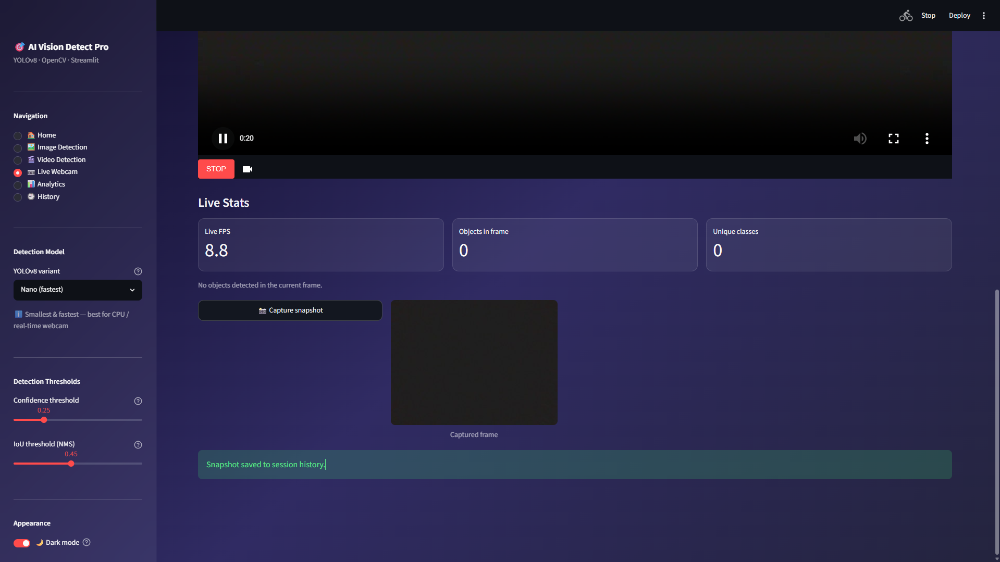
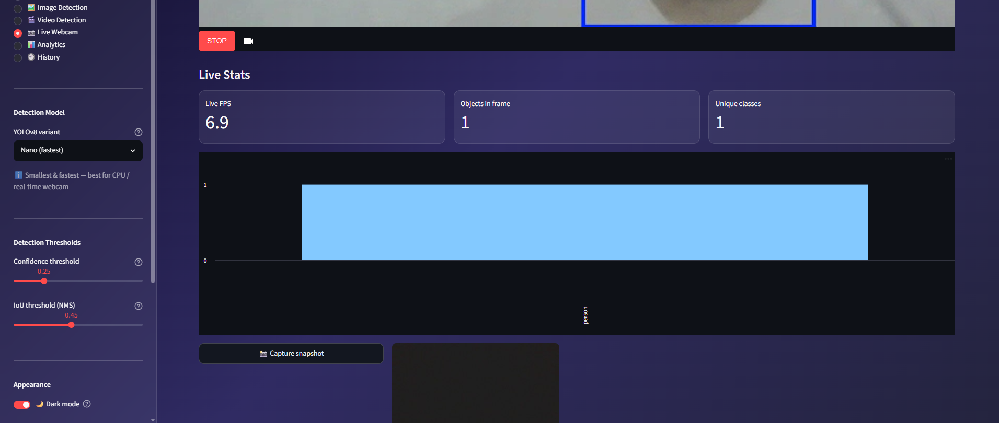

### 📊 Analytics
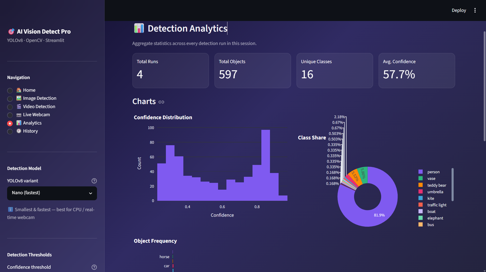
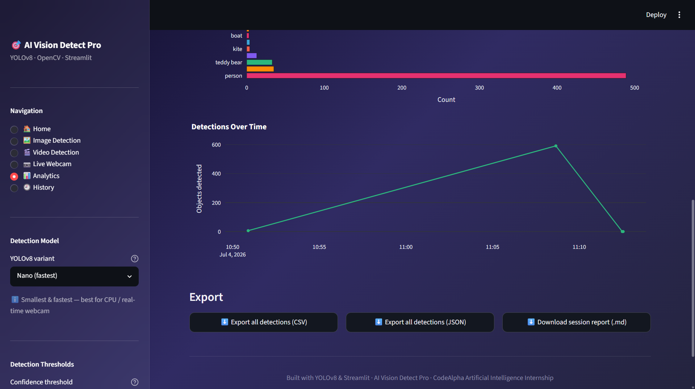

### 🕘 History
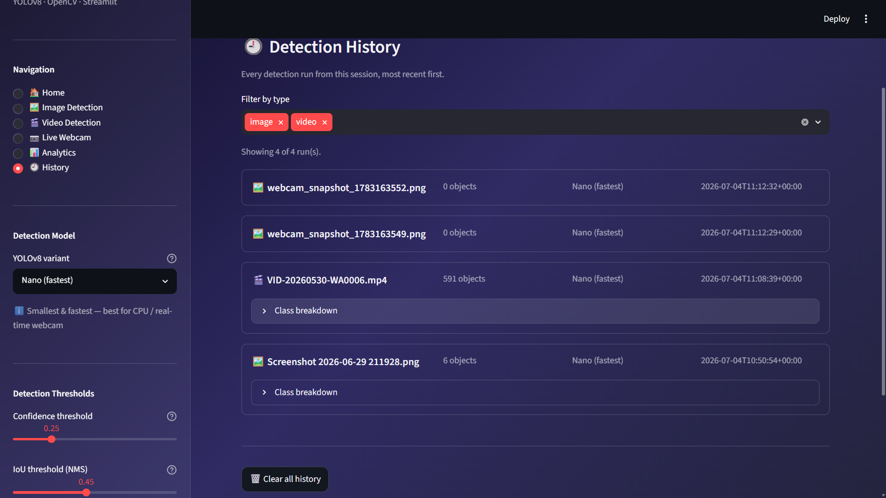
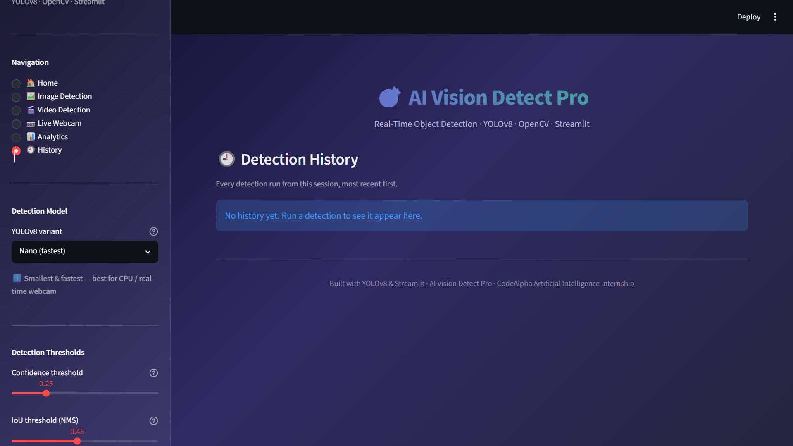

### 🌗 Themes
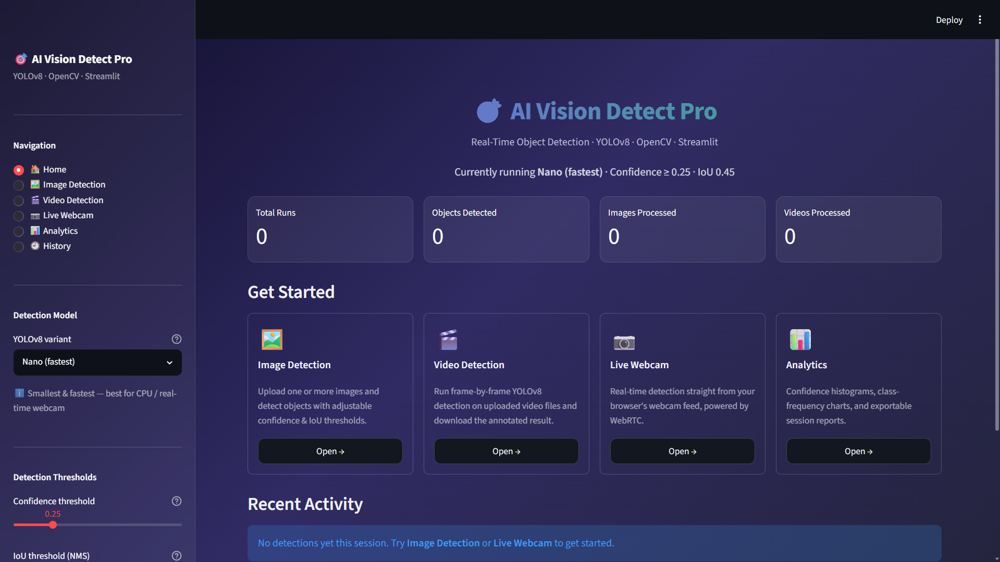
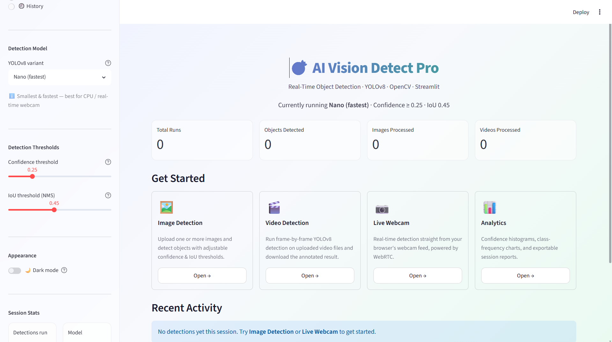

---

## 📁 Folder Structure

```
AI_Object_Detection/
├── app.py                  # Main Streamlit entrypoint
├── requirements.txt
├── README.md
├── LICENSE
├── .gitignore
├── .env.example
├── assets/                 # Static assets
├── models/                 # Downloaded YOLOv8 weights (gitignored)
├── uploads/                # Temporary uploaded files (gitignored)
├── outputs/                # Processed output videos (gitignored)
├── reports/                # Generated reports / history.json (gitignored)
├── screenshots/            # README screenshots
├── components/
│   ├── sidebar.py          # Navigation + model/threshold controls
│   ├── uploader.py         # Image & video detection pages
│   ├── dashboard.py         # Home page
│   ├── webcam.py            # Live webcam detection page
│   └── analytics.py         # Analytics & history pages
├── utils/
│   ├── detector.py          # YOLOv8 model loading & inference
│   ├── visualization.py     # DataFrames & Plotly charts
│   ├── export.py            # CSV/JSON/report export
│   ├── helpers.py           # Validation, I/O, theming
│   └── history.py           # Session history tracking
└── tests/                   # Unit tests
```

---

## 🔮 Future Improvements

- [ ] Custom-trained YOLOv8 models for domain-specific detection
- [ ] Multi-camera / RTSP stream support
- [ ] User authentication and per-user history persistence
- [ ] Dockerized deployment with GPU passthrough option
- [ ] Batch video processing queue with async job status
- [ ] Model performance benchmarking dashboard (nano → xlarge comparison)

---

## 📄 License

Distributed under the MIT License. See [`LICENSE`](LICENSE) for details.

---

## 👤 Author

**Nikhilesh**
Built as part of the **CodeAlpha Artificial Intelligence Internship**.

[](#)
[](#)

---

<div align="center">

*If this project helped you, consider giving it a ⭐ on GitHub!*

</div>
